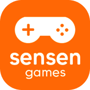

<div align="center">
<!--

-->
  
# Sensen Games

### 🎮 Criando jogos arcade acessíveis e desafiadores

[](adicionar_link_aqui)
[](https://store.steampowered.com/developer/sensengames)
[](https://drive.google.com/drive/u/0/folders/1L_eGgQdwwhAiC6X7qb9LjyxprvuhX3Ma)

</div>

---

## 📋 Índice

- [Sobre](#-sobre)
- [Tecnologias](#-tecnologias)
- [Funcionalidades](#-funcionalidades)
- [Estrutura do Projeto](#-estrutura-do-projeto)
- [Instalação](#-instalação)
- [Scripts Disponíveis](#-scripts-disponíveis)
- [Contribuições](#-como-contribuir)

---

## 🎯 Sobre

Site oficial do estúdio indie brasileiro **Sensen Games**, dois irmãos que jogam juntos desde a era do Super Nintendo e PlayStation 1 & 2. Após anos trabalhando como programador e designer web, decidiram criar jogos no estilo que amam jogar: **desafiadores e divertidos!**

> 🌐 **Demo ao vivo:** [adicionar_link_aqui](adicionar_link_aqui)

---

## 🛠 Tecnologias

<div align="center">

|                                                     Tecnologia                                                      | Versão | Descrição               |
| :-----------------------------------------------------------------------------------------------------------------: | :----: | :---------------------- |
|                |  18.3  | Biblioteca de interface |
|  |  5.6   | Tipagem estática        |
|                    |  5.4   | Build tool e dev server |
|     |  3.4   | Framework de estilos    |
|          |  25.7  | Internacionalização     |

</div>

### Outras Bibliotecas

- **React Router DOM** - Navegação SPA
- **Shadcn/ui** - Componentes de UI
- **React Helmet Async** - SEO e meta tags
- **Lucide React** - Ícones
- **EmailJS** - Envio de emails

---

## ✨ Funcionalidades

| Feature           | Descrição                                |
| :---------------- | :--------------------------------------- |
| 🌐 **Bilíngue**   | Suporte completo para Português e Inglês |
| 📱 **Responsivo** | Layout adaptável para desktop e mobile   |
| 🎮 **Catálogo**   | Exibição dos jogos com links para Steam  |
| 📧 **Contato**    | Formulário de newsletter integrado       |
| 🔍 **SEO**        | Meta tags otimizadas para buscadores     |
| 🎬 **Animações**  | Transições suaves e interativas          |

---

## 📁 Estrutura do Projeto

```
sensen-games/
├── 📂 public/
│   └── 📂 Jogos/              # Assets estáticos dos jogos
│       ├── 📂 Akuma Bloodrain/
│       ├── 📂 King Bullseye/
│       ├── 📂 Neon Ships/
│       └── ...
│
├── 📂 src/
│   ├── 📂 assets/             # Imagens e vídeos importados
│   │   ├── 📂 Equipe/         # Fotos da equipe
│   │   ├── 📂 Favicon/        # Ícones do site
│   │   ├── 📂 Icones/         # Ícones de redes sociais
│   │   ├── 📂 Jogos/          # Assets dos jogos
│   │   └── 📂 Logotipo/       # Logos do estúdio
│   │
│   ├── 📂 components/         # Componentes React
│   │   ├── 📂 ui/             # Componentes Shadcn/ui
│   │   ├── 📄 Header.tsx      # Navegação e seletor de idioma
│   │   ├── 📄 Hero.tsx        # Seção principal com vídeo
│   │   ├── 📄 About.tsx       # Sobre o estúdio
│   │   ├── 📄 Games.tsx       # Catálogo de jogos
│   │   ├── 📄 GameCard.tsx    # Card individual de jogo
│   │   ├── 📄 Contact.tsx     # Formulário de contato
│   │   ├── 📄 Footer.tsx      # Rodapé com redes sociais
│   │   └── 📄 SEO.tsx         # Componente de meta tags
│   │
│   ├── 📂 hooks/              # Custom hooks
│   │   ├── 📄 use-mobile.tsx  # Detecção de dispositivo
│   │   └── 📄 use-toast.ts    # Sistema de notificações
│   │
│   ├── 📂 lib/                # Utilitários
│   │   ├── 📄 i18n.ts         # Configuração de idiomas
│   │   └── 📄 utils.ts        # Funções auxiliares
│   │
│   ├── 📂 locales/            # Arquivos de tradução
│   │   ├── 📄 pt.yml          # Português (padrão)
│   │   └── 📄 en.yml          # Inglês
│   │
│   ├── 📂 pages/              # Páginas da aplicação
│   │   ├── 📄 Index.tsx       # Página inicial
│   │   ├── 📄 Games.tsx       # Página de jogos
│   │   └── 📄 NotFound.tsx    # Página 404
│   │
│   ├── 📄 App.tsx             # Componente principal
│   ├── 📄 App.css             # Estilos globais
│   ├── 📄 index.css           # Configuração Tailwind
│   └── 📄 main.tsx            # Ponto de entrada
│
├── 📄 index.html              # HTML principal
├── 📄 tailwind.config.ts      # Configuração Tailwind
├── 📄 vite.config.ts          # Configuração Vite
└── 📄 package.json            # Dependências
```

---

## 🚀 Instalação

### Pré-requisitos

- [Node.js](https://nodejs.org/) (v18 ou superior)
- [npm](https://www.npmjs.com/) ou [bun](https://bun.sh/)

### Passo a passo

```bash
# 1. Clone o repositório
git clone <URL_DO_REPOSITORIO>

# 2. Entre na pasta do projeto
cd sensen-games

# 3. Instale as dependências
npm install
# ou
bun install

# 4. Inicie o servidor de desenvolvimento
npm run dev
# ou
bun dev

# 5. Acesse no navegador
# http://localhost:5173
```

---

## 📜 Scripts Disponíveis

| Comando           | Descrição                          |
| :---------------- | :--------------------------------- |
| `npm run dev`     | Inicia servidor de desenvolvimento |
| `npm run build`   | Gera build de produção             |
| `npm run preview` | Visualiza build de produção        |
| `npm run lint`    | Executa verificação de código      |

---

<div align="center">

<!--

-->

## 🤝 Como Contribuir

Contribuições são bem-vindas! Siga os passos abaixo:

### Pré-requisitos

- [Node.js](https://nodejs.org/) (v18 ou superior)
- [npm](https://www.npmjs.com/) ou [bun](https://bun.sh/)

### 1. Fork o repositório

```bash
# Clique no botão "Fork" no GitHub
# ou use o GitHub CLI
gh repo fork sensen-games/site
```

### 2. Clone seu fork

```bash
git clone https://github.com/SEU_USUARIO/site.git
cd site
```

### 3. Crie uma branch

```bash
# Para novas funcionalidades
git checkout -b feature/minha-feature

# Para correções de bugs
git checkout -b fix/correcao-bug
```

### 4. Faça suas alterações

- Siga o padrão de código existente
- Use **TypeScript** com tipagem estrita
- Utilize tokens do **Tailwind** (evite cores hardcoded)
- Mantenha componentes pequenos e focados

### 5. Commit suas mudanças

```bash
# Use commits semânticos
git commit -m "feat: adiciona nova seção de jogos"
git commit -m "fix: corrige responsividade do header"
git commit -m "docs: atualiza README"
```

#### Tipos de commit

| Tipo       | Descrição                      |
| :--------- | :----------------------------- |
| `feat`     | Nova funcionalidade            |
| `fix`      | Correção de bug                |
| `docs`     | Documentação                   |
| `style`    | Formatação (não altera código) |
| `refactor` | Refatoração de código          |
| `test`     | Adição de testes               |
| `chore`    | Tarefas de manutenção          |

### 6. Push e Pull Request

```bash
git push origin feature/minha-feature
```

Depois, abra um **Pull Request** no GitHub com:

- Título descritivo
- Descrição das mudanças
- Screenshots (se houver mudanças visuais)

### Diretrizes

- ✅ Mantenha o código limpo e legível
- ✅ Teste suas alterações localmente
- ✅ Atualize a documentação se necessário
- ✅ Respeite a estrutura de pastas existente
- ❌ Não commite arquivos de build ou node_modules

**Feito com ❤️ por Sensen Games**

</div>
